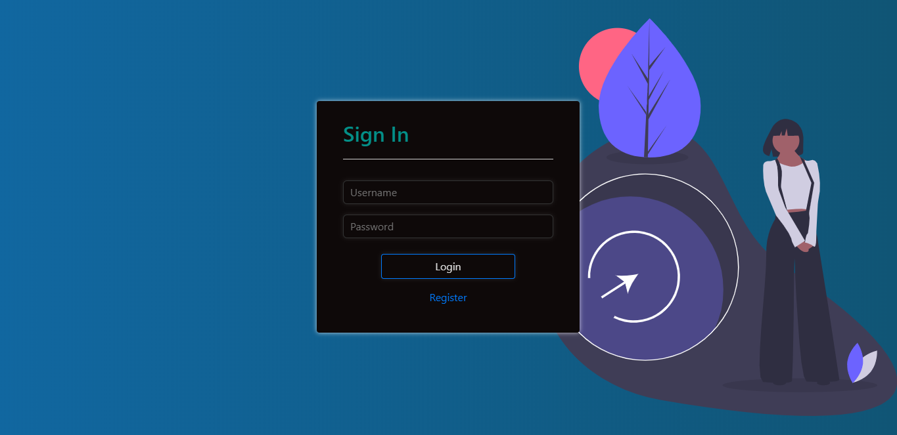
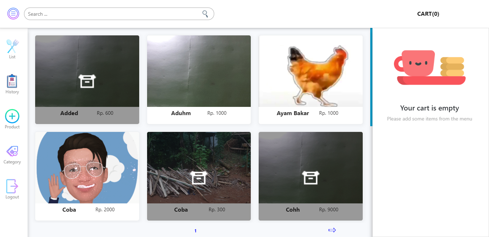
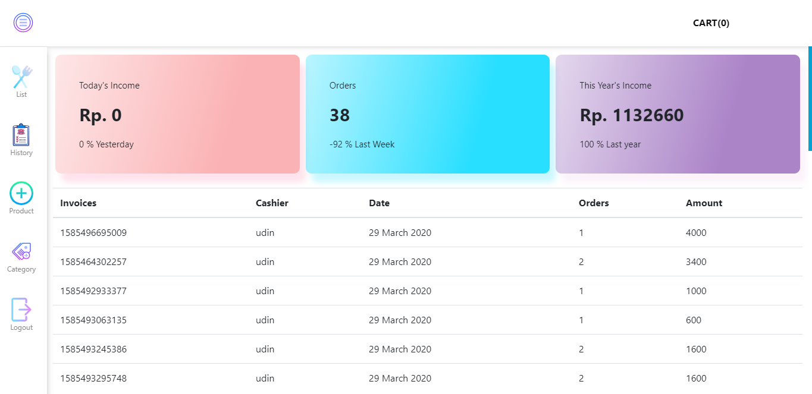
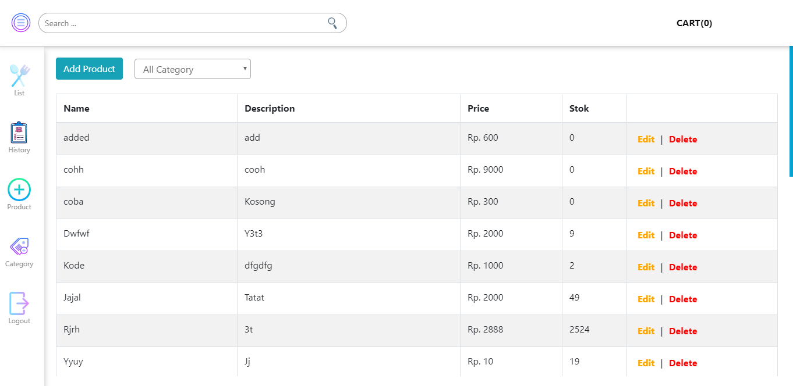

<div class="header">
	<ul>
		<li><a href="#">home</a></li>
		<li><a href="#requirements">requirements</a></li>
		<li><a href="#run">How To Run</a></li>
		<li><a href="#screenshoot">screenshoot</a></li>
		<li><a href="#project">related project</a></li>
		<li class="app"><a href="http://localhost:3000" target="_blank">go to app</a></li>
	</ul>
</div>


<section id="home">
	
<h1 align="center">Hayuu Cafe Front-end</h1>

Hayuu cafe is an application to manage sales at hayuu cafe, build with ReactJS.
</section>

<section id="requirements">
	
## Requirements
* [`npm`](https://www.npmjs.com/get-npm)
* [`React Js`](https://www.npmjs.com/get-npm)
* [`react-bootsrap`](https://www.npmjs.com/get-npm)
* [`sweetalert`](https://www.npmjs.com/get-npm)
</section>

<section id="run">
	
## How To Run
1. Open your terminal or command prompt
2. Type `git clone https://github.com/misrudin/Front-end-PointOfSales.git`
3. Open the folder and type `npm install` for install dependencies
	#### Setup .env
		Open .env file on your favorite code editor, and copy paste this code below :
		```
		REACT_APP_URL="http://localhost:4001/api/v1/"
		```
4. type `npm start` for run dependencies
</section>

<section id="screenshoot">
	
## Screenshoot
<div class="demo">
    <div class="items">
    	<h4 class="title-demo">Login Page</h4>
		  
    </div>
    <div class="items">
    	<h4 class="title-demo">Home Page</h4>
		  
    </div>
    <div class="items">
    	<h4 class="title-demo">History</h4>
		  
    </div>
    <div class="items">
    	<h4 class="title-demo">Add Product</h4>
		  
    </div>
    <div class="items">
    	<h4 class="title-demo">Add Category</h4>
		  
    </div>
</div>
</section>

<section id="project">
	
## Related Project
* [`Hayuu-Cafe-Backend`](https://github.com/misrudin/NodeWithExpress-backend-PointOfSales.git)
* [`Hayuu-Cafe-Mobile`](https://github.com/misrudin/PosReactNative.git)
</section>
